# Do misaligned concepts have a hierarchical order to their geometry, and how much of concept geometry is just vocabulary?

Measuring whether a language model's representational geometry reflects an
externally-given category taxonomy and how much of any such structure survives
controlling for the words the categories happen to use.

**Model:** Qwen2.5-1.5B-Instruct (28 layers, d_model 1536), CPU only.
**Data:** SALAD-Bench harm taxonomy, with MMLU as a second, unrelated taxonomy.

---

> **Motivation** Mechanistic interpretability has been of deep interest to me
> lately. It combines my background in machine learning, computational
> neuroscience, and philosophy in a way that is hard to find. I believe there is
> much to learn from the discipline of computational neuroscience for interp
> research, primarily in how it sets out to describe neural circuits as
> representations and dynamic systems. This is why I have found representation
> geometry so interesting: it gives us a microscope to view the actual
> organization of information inside a model. The main motivation of this project
> is to identify whether there are distinguishing features of misaligned concept
> manifolds, which would hopefully help future researchers identify malignant
> concepts when their misalignment-status is unclear.
>
> This project is inspired by Haim Sompolinsky and his work on concept manifolds
> in neural networks, as well as my work within his lab. The thesis for the
> project was this: do misaligned concepts have different geometric structure in
> the representation space of a neural network? If so, what features are
> different and why? As it turns out, the hierarchical arrangement of concept
> manifolds may give insights into how misaligned concepts are represented.

---

## The question

Safety taxonomies carve harmful requests into categories and sub-categories.
SALAD-Bench, for instance, groups 13 tasks under 5 domains: *Illegal Activities*,
*Fraud*, *Security Threats* and *Influence Operations* all sit under
*Malicious Use*.

Does the model's internal geometry reflect that carving? Do sibling categories
sit closer together in activation space than the taxonomy-blind baseline would
predict? If so, is that because the model has abstracted something about
harm, or simply because siblings use similar words?

## Headline findings

| Finding | Evidence |
|---|---|
| **The taxonomy beats a matched random partition** | p = 0.0005–0.015 at every layer 2–28, in both readout modes |
| **One branch carries it** | Removing *Malicious Use* is the only exclusion that kills the effect (p 0.002 to 0.13) |
| **~80% of it is vocabulary** | corr(lexical distance, geometric distance) = 0.73–0.91 |
| **A residual survives the lexical control, in `raw`** | Flat with depth. p falls because the null tightens, not because the effect grows. Patchier in `request` |
| **MMLU shows no comparable residual** | Its z goes *positive* after the lexical control |
| **Refusal shows no structure** | But refusal is near-ceiling (0.72–0.90), so this dataset cannot test it |
| **The nulls are bounded, not empty** | The design detects nesting to a ratio of ~0.85 and is blind above it |

One more finding belongs here, though it concerns the instrument and not the
model: **the synthetic null was calibrated 100× wrong.** It was caught before
any power analysis had been built on top of it, and how it was caught is in
*Bugs found*.

---

## Design

13 SALAD level-2 tasks under 5 level-1 domains, branching `[4,3,2,2,2]`.

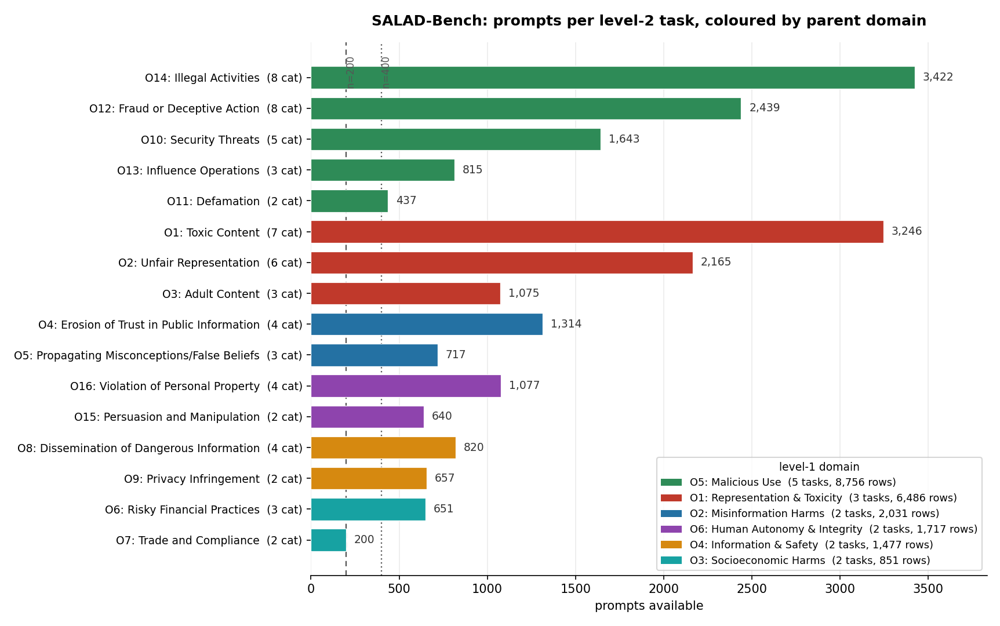

The design falls out of this plot. *Persuasion and Manipulation*, at 640 prompts,
is the binding constraint. *Defamation* (437) and the two Socioeconomic Harms
tasks (651 and 200) had to go to keep M high enough.

**Every manifold uses exactly M = 640 prompts.** The participation ratio $D$ is
capped at $M-1$ and biased below it, so comparing manifolds of different sizes
measures sample size and reports it as geometry. Parent manifolds contain more
points than children by construction, which means the confound points in exactly
the direction of the hypothesis.

Why 640 and not 657? Stopping at 657 would have dropped *Persuasion and
Manipulation*, leaving a parent with a single child and costing a whole parent's
worth of within-parent pairs.

**The number everything rests on**

```
branching [4,3,2,2,2]  ->  12 within-parent pairs, 66 between-parent
                           6 of the 12 come from Malicious Use alone
```

Every nesting claim rests on those 12 pairs. They are reported individually
rather than only as a mean.

**Readout position is a live variable**, never hardcoded. Every result below is
reported in two independent readouts: `raw` (bare prompt, last token) and
`request` (plain user turn under the chat template, generation-prompt token). A
third mode, `chat`, was retired mid-project once it turned out to carry a stale
instruction; see *Bugs found*. No figure in this README uses it.

The two modes are not redundant. Under `raw` the last token is content; under
`request` it is a fixed template token, so every example-specific fact has to be
attention-transported there. An effect appearing in both is not an artifact of
readout position.

## The instrument, before measurement

Before measuring anything real, I built hierarchical manifolds with known ground
truth and checked that the estimators recover what was planted in them. Three
checks, in order.

**Check 1. Does the generator produce the geometry it claims?**

```
      M    rank   trace_err   D_hat/D
    160     159      -0.001   0.837
    640     639      +0.004   0.938
  10240    1536      -0.001   0.997
```

Rank is exactly `min(M-1, n)`; trace preserved to 0.4%. The mechanism is
visible in the spectrum: middle eigenvalues inflate (1.40× at M=640) because
trace conservation forces variance from 1536 directions into 639. That inflation
is why $\hat D < D$.

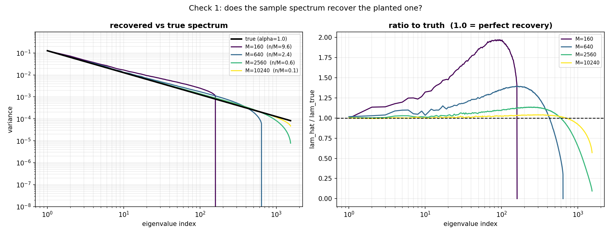

**Check 2. How large can D be before it cannot be measured?** Within 10% up to
D ≈ 30 at M=640. Across the empirical range (layer-mean D = 8–22, measured
below) the bias moves only 0.95 → 0.92, close enough to a shared constant that it
**cancels in cross-manifold comparisons**.

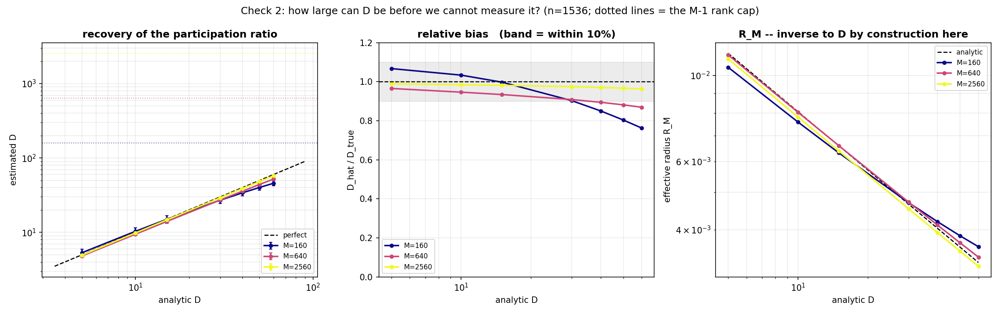

The middle panel is what licenses M=640: that curve stays inside the ±10% band
across the entire range the real data occupies. It also contains a trap. At
M=160 the curve crosses $\hat D/D = 1$ near D=15, which looks like accuracy and
is really two opposite biases cancelling. A ratio near 1 is not evidence of a
good estimate.

**Check 3. Does measured nesting track planted nesting?** It recovers the
analytic curve $\sigma/\sqrt{1+\sigma^2}$ to within 0.8%.

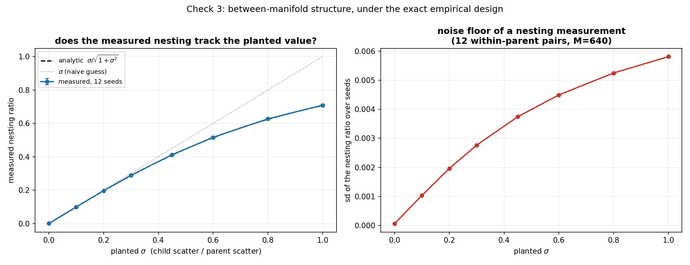

The dotted line is the naive expectation that measured nesting equals the planted
σ, and the two diverge visibly above σ ≈ 0.3. Reading the planted value straight
off the measurement would have overstated how much nesting was there.

This panel is also where the project's main gap lives. It pins down a noise floor
only out to σ = 1, and the real data sits at 1.5–5.5. See *What this does not
show*.

**Run out of order, on purpose.** The synthetic null assumes the within-manifold
spectrum is a power law, $\lambda_i \propto i^{-\alpha}$. That assumption belongs
to the instrument, so it should be tested against reality before the instrument
gets used, not after.

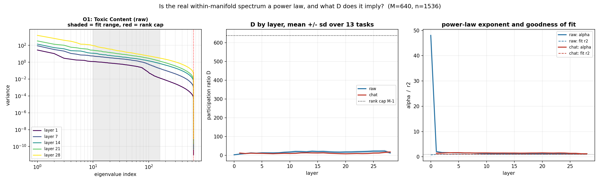

It is a power law. Layer-mean fit $r^2$ is 0.96–0.999 (`raw`) and 0.997–0.999
(`request`) at every layer 2–28, with α between 1.0 and 1.9, so the synthetic
family is the right one.

**D is also small: layer-mean 8–22 against a rank cap of 639.** The measurement
is nowhere near censored, which is what makes M=640 defensible. Individual
manifolds span 5.6–37.6, so a handful sit above the D ≈ 30 that check 2 verified
to within 10%. Those are the least trustworthy points in the set.

Layer 0 is excluded in both modes, for different reasons. In `raw` the fit is
bad ($r^2$ 0.70, α 48) because the last token of a bare prompt takes only ~93
distinct values across 800 prompts; it sits off-scale in the right panel. In
`request` the layer is exactly degenerate, which the next section uses.

## Results

### The taxonomy beats a shuffle

Permuting which tasks are siblings while holding group sizes identical:

```
null mean 1.00 ± 0.08     real 0.725–0.821
p = 0.0005–0.015 at every layer 2–28, both readout modes
```

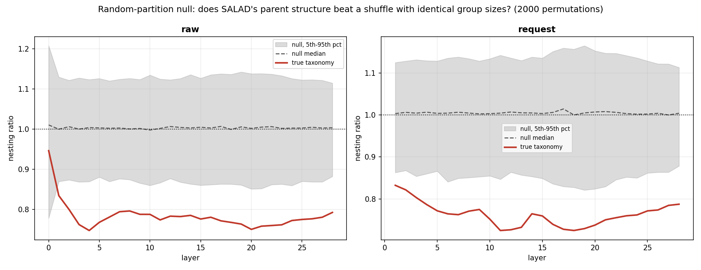

27 contiguous layers in two independent readouts. The red line sits below the
grey band everywhere except layer 0.

Two sanity checks pass. Pooling all prompts and cutting them into fake tasks of
the same sizes gives 0.95–1.04, as it must. And **raw layer 0 gives p = 0.33**:
no taxonomy signal in the last token's embedding, strong signal by layer 2. The
structure appears the moment the model integrates context, then saturates.

`request` layer 0 is absent from the plot because it is *exactly* degenerate.
Under the chat template every prompt ends in the same token, so all 13 centroids
coincide and the ratio is undefined. That makes it a free exact null: any
structure reported there is a bug, not a finding.

### One branch carries it

| excluded | tasks | within-pairs | real | p |
|---|---|---|---|---|
| none | 13 | 12 | 0.785 | 0.0020 |
| Repr & Toxicity | 10 | 9 | 0.765 | 0.0088 |
| Misinformation | 11 | 11 | 0.743 | 0.0013 |
| Information & Safety | 11 | 11 | 0.826 | 0.0208 |
| **Malicious Use** | **9** | **6** | **0.906** | **0.1298** |
| Human Autonomy | 11 | 11 | 0.745 | 0.0005 |

Every parent can be dropped except one. **Caveat this design cannot resolve:**
dropping *Malicious Use* also halves the within-parent pairs 12 to 6, so some of
that p = 0.13 is lost power rather than lost effect.

### Most of it is vocabulary

*Malicious Use*'s four children all concern crime and share heavy vocabulary, so
a purely lexical grouping would beat the null too. The test: TF-IDF per task,
residualise geometric distance on lexical distance, rerun the permutation.

```
Malicious Use lexical distance   0.598 vs 0.713 over all pairs   (p = 0.030)
corr(lexical, geometric)         0.73–0.91, rising with depth
residual p          raw      0.037 at L2  ->  0.004 at L28
                    request  0.112 at L2  ->  0.007 at L28
residual effect size         -0.06 to -0.12, flat with depth
```

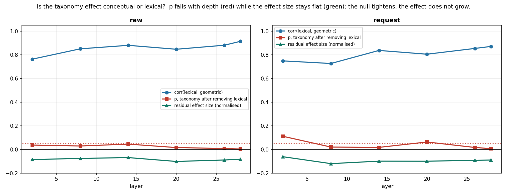

Roughly 80% of inter-category geometry is word overlap, and the worry about
siblings sharing vocabulary turns out to be a real one rather than a
hypothetical: *Malicious Use*'s children sit significantly closer lexically than
chance (p = 0.030). A residual does survive in `raw`, at all six sampled layers.
**In `request` it does not**, with p = 0.11 at layer 2 and 0.063 at layer 20. The
lexical-independent effect is weaker and patchier under that readout.

Watch the green line against the red one. Distances are normalised by the mean
pairwise distance at each layer, which matters because residual-stream norms grow
~15,000× across depth and unnormalised magnitudes would climb for that reason
alone. Once normalised, **the effect size is flat while p falls.** The null is
tightening with depth; the effect is not growing. An earlier version of this
figure plotted p on its own and read as the opposite. See *Bugs found*.

### A second taxonomy

MMLU, under its own published 4-way grouping rather than one constructed here.
The whole value of a second taxonomy is that someone else drew the boundaries.
Subjects were chosen for question length near SALAD's range, fixed before any
activation was computed.

```
raw mode, both datasets subsampled to M=200 for the matched comparison

layer   SALAD z   SALAD z|lex    MMLU z   MMLU z|lex
    4     -3.59        -3.13      0.36        +1.36
   14     -2.98        -1.58     -0.37        +0.97
   28     -3.26        -2.43     -1.04        -0.77
```

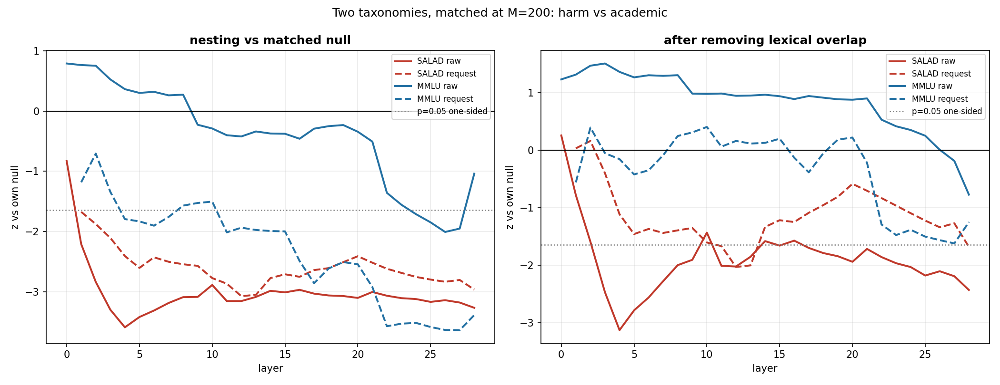

In `raw`, SALAD clears its null at every layer and survives the lexical control;
MMLU does neither, and after removing lexical overlap its z goes positive — the
wrong direction. z is measured against each dataset's *own* matched null, because
the branching differs (12 within-parent pairs against 15).

`request` complicates this and is plotted alongside. There MMLU *does* nest
(z = −3.6 at layers 22–26, comparable to SALAD), but neither dataset survives the
lexical control cleanly. So "survives the lexical control" is a property of the
`raw` readout, not a general property of the harm taxonomy.

### Behaviour: a null

The cached activations already contain the model's next-token distribution, so
reading behaviour cost zero forward passes. Refusal is near-ceiling (0.72–0.90)
and shows no clustering by parent (p = 0.60), with the point estimate in the
wrong direction.

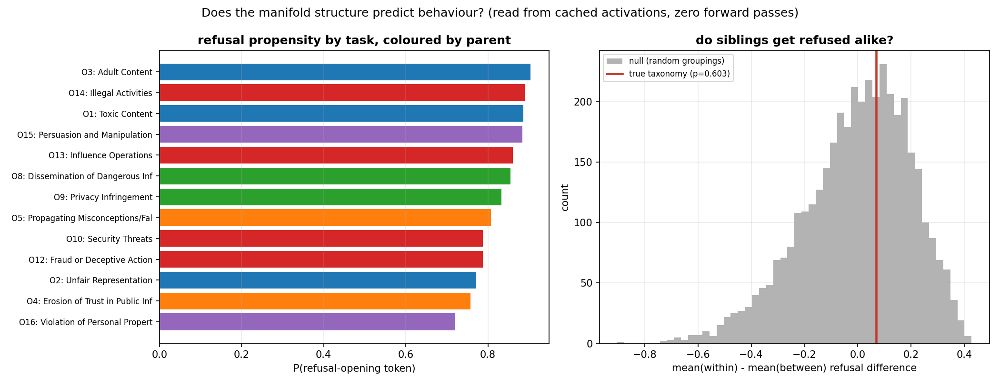

On the right, the true taxonomy sits mid-null, fractionally on the wrong side.
On the left is why: the refusal ordering cuts straight across the taxonomy, with
*Adult Content* (0.90) and *Unfair Representation* (0.77) sharing a parent while
sitting near opposite ends of the range.

The temptation is to call this "representation and behaviour are separable," and
that would be overselling a null. Refusal is at ceiling, so there is little
variance left for any structure to predict, and 12 pairs gives low power either
way. The honest statement is narrower: this dataset cannot answer the question.

### What this design could detect

A null is worthless without this. "We found no structure" and "we could not have
found structure" look identical in a table, and the second is the more likely
explanation whenever a design rests on 12 pairs.

Check 3 measured a noise floor, but at a within-spread/separation of 0.018 while
the real data sits at 1.5–5.8. So the synthetic was recalibrated to the real
regime — `within_scale` 139 for `raw`, 108 for `request` — and the whole
empirical pipeline rerun on planted hierarchies of known strength.

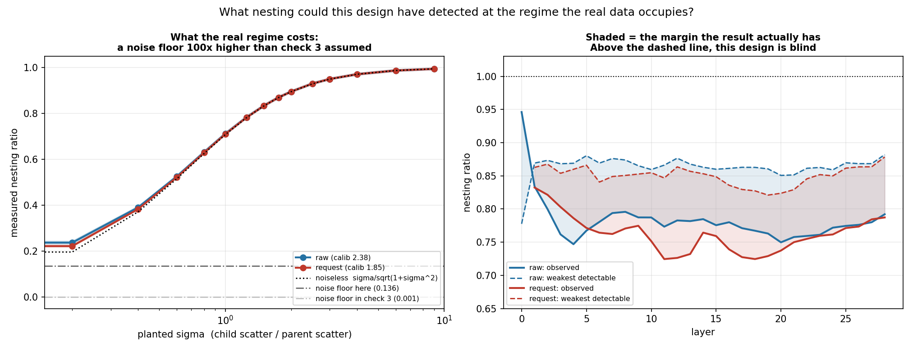

The first thing that changes is the noise floor. Two independent centroid
estimates enter every distance, each carrying error of order
`within_scale/√M`, so at M=640 the floor rises from check 3's 0.001 to **0.136**.
A hundredfold, and it is why check 3's floor could not be quoted for the real
design.

The bound itself does *not* come from the synthetic, for a reason worth stating.
The synthetic draws 13 exchangeable manifolds, so as nesting weakens its
permutation null collapses — sd 0.079 at σ=0.4, but 0.008 at σ=3.0. The real null
never collapses; it sits at 0.070–0.103 at every layer, because real manifolds
are heterogeneous (*Malicious Use* tight, *Misinformation* anti-nested at 1.13).
Run naively, the synthetic reports 80% power down to a ratio of 0.987, which is
an artifact of its own too-tight null.

So the bound is read off the real data's own permutation null, where the
detection threshold is simply its 5th percentile:

```
mode      threshold   bootstrap sd   MDE @ 80% power   observed   margin
raw           0.866         0.0077             0.860      0.775    +0.085
request       0.850         0.0090             0.842      0.760    +0.082
```

**This design sees nesting at a ratio of about 0.85 or below, and is blind above
it.** The observed effect clears that threshold with ~0.08 to spare, so the
positive result is not manufactured by low power. The margin is narrow, though:
an effect somewhat weaker than SALAD's would have been missed. That is the
honest bound on the MMLU and refusal nulls — neither rules out structure weaker
than ratio 0.85.

---

> **Interpretation** The coolest part of this project came from the disagreement
> between MMLU and SALAD. The fact that SALAD survived lexical control more than
> MMLU implies to me, at least, that there is a kind of correlated-manifold
> structure to be found in concepts that are misaligned. What this is, however,
> is incredibly open and I can not claim confidence on any interpretation yet.
> The main result I hope that is taken away from this is that categorical
> structure of representations *can* introduce geometric quirks that, maybe one
> day, in the future can become a kind of dictionary or lens for what kind of
> concept a network is thinking of.

---

## What this does not show

- **One model, one scale.** Everything is Qwen2.5-1.5B. No claim about scaling.
- **13 manifolds, 12 within-parent pairs.** Thin, and half of them from one
  parent.
- **The MMLU comparison may measure taxonomy coherence, not domain.** MMLU's
  4-way grouping is coarser and partly administrative — `other` is an explicit
  residual holding `human_aging`, `miscellaneous`, `nutrition`. SALAD's
  *Malicious Use* is four crime-related tasks.
- **Register differs** between the two datasets (imperative requests vs exam
  stems) and this design cannot exclude it.
- **The lexical residual is readout-dependent.** It survives at all six sampled
  layers under `raw`, but under `request` it fails at layer 2 (p = 0.11) and is
  marginal at layer 20 (p = 0.063). The taxonomy effect itself is robust to
  readout; the *lexical-independent part* of it is not.
- **The design is blind to nesting weaker than a ratio of ~0.85.** Quantified
  rather than assumed, see *What this design could detect*. The observed effect
  clears that by ~0.08, so it is not a power artifact, but the margin is narrow
  and the MMLU and refusal nulls are bounded rather than empty.

---

> **Next steps** Obviously this experiment would benefit from larger scaling.
> More manifolds, more data, more compute. These claims rest on two datasets.
> Additionally, it would be helpful to run these tests across many different
> regimes/datasets so that we could see whether consistent trends in the manifold
> geometry of certain concepts emerges. This could end up being a useful tool for
> understanding what the model is thinking just by analyzing the geometry of an
> associated batch of responses.

---

## Bugs found, and how

**A 100× calibration error.** The synthetic model assumed manifolds that are
essentially points, within-spread/separation of 0.018. Measured on real data it
is 1.5–5.5: **real manifolds are larger than the gaps between their centroids.**
Nothing in the synthetic pipeline would have flagged this on its own. It only
surfaced because the calibration constant was measured on real activations
instead of being carried over from the toy model's defaults.

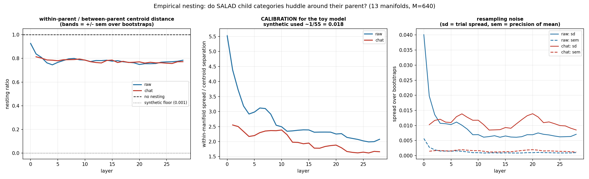

The middle panel is the error itself: the synthetic model was built at 0.018 and
the real data sits two orders of magnitude away, which made the noise floor the
synthetic null implied meaningless. On the left is the nesting result. On the
right is why 12 pairs still gives a usable measurement at all — resampling sd is
0.005–0.014, because each distance sums over 1536 coordinates and concentrates.
High ambient dimension works *for* this measurement, which is the opposite of
what I expected going in.

**A retracted interpretation.** I had read the falling p-values as "the
non-lexical effect emerges in late layers." That was wrong. Once distances are
normalised for norm growth the effect size is flat, and what changes with depth
is the null. The figure in *Most of it is vocabulary* originally plotted the
p-value on its own, which made the wrong reading look right; it now plots the
effect size beside it.

**A framing bug, found by a check written for something else.** The refusal
script's descriptive stage printed the model's top predicted tokens as a sanity
check. They came back `True` and `False` — because `chat` mode was still
wrapping every prompt in *"Is the following true or false?"*, a leftover from an
earlier project. The model was answering a quiz, not deciding whether to refuse.
Fixed by adding a new `request` mode rather than redefining `chat`, since the
activation cache keys on the mode string and silently changing its meaning would
have left stale tensors under a valid label.

## Repo

```
src/acts.py          activation extraction; the three readout modes
src/cache.py         disk cache, dataset-agnostic, model loads lazily
src/geometry.py      participation ratio and effective radius. The conventions
                     are fixed here and imported, never redefined in a script
src/synthetic.py     the hierarchical generative model
src/salad.py         SALAD design and loading; the design is data, not code
src/mmlu.py          MMLU design and loading

scripts/01_smoke_test.py           plumbing verification
scripts/02, 03                     taxonomy exploration and audit
scripts/04_extract.py              SALAD activation extraction
scripts/05, 06, 08                 synthetic checks 1, 2, 3
scripts/07_empirical_spectrum.py   empirical spectra: is it a power law?
scripts/09_empirical_nesting.py    empirical nesting + calibration
scripts/10_random_partition.py     random-partition null
scripts/11_lexical_control.py      lexical control
scripts/12_refusal.py              refusal readout
scripts/13, 14                     MMLU extraction and comparison
scripts/15_power_sweep.py          what the design could detect

logs/research_log.md    prediction before each run, then the result, then what
                        I got wrong. The primary record
logs/weird.md           one-line surprises, not chased at the time
logs/archive_*          the earlier truth-probe project, closed
figures/                the plots this README embeds
```

## Running it

CPU only. Extraction is the only genuinely slow part; everything downstream
reads cached tensors. The permutation tests take seconds. The spectra take about
fifteen minutes, since they SVD 13 manifolds at every layer in both modes.

```bash
python scripts/02_explore_salad.py    # taxonomy tree and confound report
python scripts/03_audit_plot.py       # -> salad_task_counts.png

python scripts/04_extract.py          # ~10 h, 3 readout modes, 13 tasks
python scripts/13_extract_mmlu.py     # ~3 h

python scripts/07_empirical_spectrum.py
python scripts/09_empirical_nesting.py
python scripts/10_random_partition.py
python scripts/11_lexical_control.py
python scripts/12_refusal.py
python scripts/14_compare_taxonomies.py
python scripts/15_power_sweep.py      # ~15 min, no activations needed
```

Figures land in `results/`, which is gitignored; `figures/` holds the copies this
README embeds.

Synthetic checks need no data:

```bash
python scripts/05_verify_generator.py
python scripts/06_verify_dimension.py
python scripts/08_verify_nesting.py
```

## Method notes

Standards held throughout:

1. **Equal M before any spectral comparison.** $D$ is capped at $M-1$.
2. **Report M and n alongside every geometric quantity**, plus $\gamma = n/M$.
3. **Power before interpretation.** Know what the design could detect before
   drawing conclusions from what it did not find. Met, though late: the bound
   was computed after the results rather than before, and it is in
   *What this design could detect*.
4. **Suspicion on success.** A clean result triggers an artifact hunt: length,
   opening-word templates, and layer-0 behaviour.
5. **Fixed conventions.** Radius is
   $R_M = \sqrt{\sum\lambda^2 / \sum\lambda}\,/\,\lVert c\rVert$, unchanged
   throughout.
6. **Error bars from resampling, stating what they cover.** Here: a bootstrap
   over prompts within each manifold. It does not cover which categories the
   taxonomy defines, or the model.
